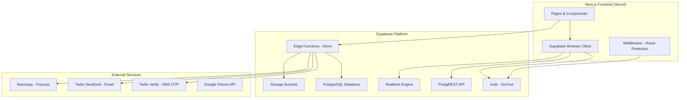
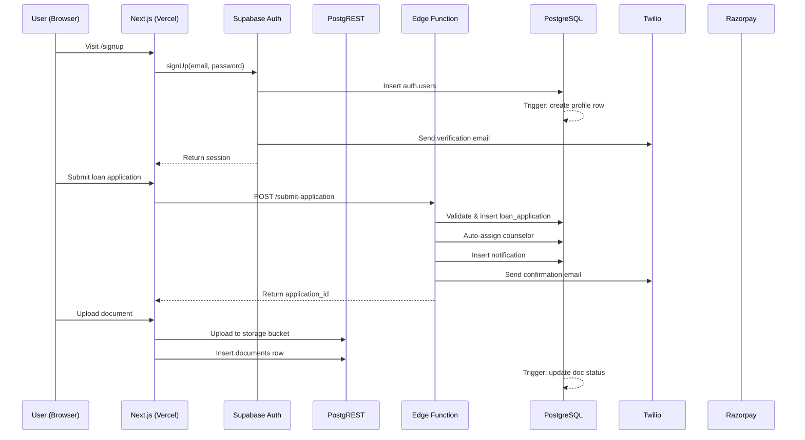

# FundMyCampus — Backend Product Requirements Document

> **Version:** 1.0.0  
> **Last Updated:** March 2026  
> **Architecture:** Supabase (PostgreSQL + Auth + Storage + Edge Functions + Realtime + RLS)  
> **Status:** Implementation Ready  

---

## Table of Contents

1. [Architecture Overview](#1-architecture-overview)
2. [Database Schema](#2-database-schema)
3. [Row Level Security (RLS) Policies](#3-row-level-security-rls-policies)
4. [Supabase Storage Buckets](#4-supabase-storage-buckets)
5. [Edge Functions](#5-edge-functions)
6. [PostgreSQL Triggers & Functions](#6-postgresql-triggers--functions)
7. [Realtime Subscriptions](#7-realtime-subscriptions)
8. [API Endpoints](#8-api-endpoints)
9. [Authentication & Authorization](#9-authentication--authorization)
10. [Email Templates](#10-email-templates)
11. [Admin Panel Requirements](#11-admin-panel-requirements)
12. [Environment Variables](#12-environment-variables)
13. [Migration Plan](#13-migration-plan)
14. [Security Considerations](#14-security-considerations)
15. [Monitoring & Logging](#15-monitoring--logging)

---

## 1. Architecture Overview

### 1.1 System Diagram



### 1.2 Technology Stack

| Layer | Technology | Purpose |
|-------|-----------|---------|
| Database | PostgreSQL 15 (Supabase) | Primary data store |
| Auth | Supabase Auth (GoTrue) | User authentication |
| API | PostgREST + Edge Functions | REST API auto-generated from schema + custom business logic |
| Storage | Supabase Storage | Document & avatar file storage |
| Realtime | Supabase Realtime | WebSocket subscriptions for live updates |
| SMS/OTP | Twilio Verify | Phone number verification |
| Email | Twilio SendGrid | Transactional emails |
| Payments | Razorpay | Referral payouts |
| Hosting | Supabase Cloud | Backend infrastructure |
| Frontend | Vercel | Next.js hosting |

### 1.3 Data Flow



---

## 2. Database Schema

### 2.1 Enum Types

```sql
-- User roles
CREATE TYPE public.user_role AS ENUM ('user', 'counselor', 'admin');

-- Gender options (lowercase to match frontend)
CREATE TYPE public.gender_type AS ENUM ('male', 'female', 'other');

-- Marital status (lowercase to match frontend)
CREATE TYPE public.marital_status_type AS ENUM ('single', 'married', 'divorced', 'widowed');

-- Document types (matches frontend DocumentType)
CREATE TYPE public.document_type AS ENUM (
  'offer_letter',
  'passport',
  'pan_card',
  'aadhar_card',
  'academic_transcripts',
  'bank_statements',
  'income_proof',
  'co_applicant_income_proof',
  'collateral_documents',
  'photo',
  'other'
);

-- Document review status
CREATE TYPE public.document_status AS ENUM (
  'not_uploaded',
  'pending_review',
  'under_review',
  'verified',
  'rejected'
);

-- Loan application status (matches frontend LoanStatus)
CREATE TYPE public.loan_status AS ENUM (
  'draft',
  'submitted',
  'under_review',
  'documents_required',
  'bank_processing',
  'sanctioned',
  'disbursed',
  'rejected',
  'cancelled'
);

-- Bank offer status (matches frontend BankOfferStatus)
CREATE TYPE public.bank_offer_status AS ENUM (
  'matched',
  'applied',
  'approved',
  'rejected'
);

-- Referral status
CREATE TYPE public.referral_status AS ENUM (
  'pending',
  'applied',
  'sanctioned',
  'disbursed',
  'paid',
  'expired'
);

-- Payout status
CREATE TYPE public.payout_status AS ENUM (
  'pending',
  'processing',
  'completed',
  'failed'
);

-- Notification type (matches frontend NotificationType)
CREATE TYPE public.notification_type AS ENUM (
  'application_update',
  'document_verified',
  'document_rejected',
  'bank_offer',
  'referral_signup',
  'referral_qualified',
  'referral_payout',
  'counselor_assigned',
  'general'
);

-- Course level (matches frontend CourseLevel)
CREATE TYPE public.course_level AS ENUM (
  'undergraduate',
  'postgraduate',
  'diploma',
  'phd',
  'certificate'
);

-- Note: university_application_status and hear_about_us are stored as TEXT
-- to allow frontend flexibility without requiring DB migrations for new options.

-- Contact submission status
CREATE TYPE public.contact_status AS ENUM (
  'new',
  'contacted',
  'resolved',
  'spam'
);
```

### 2.2 Table: `profiles`

Extends `auth.users`. Created automatically via trigger on user signup.

```sql
CREATE TABLE public.profiles (
  id                          UUID PRIMARY KEY REFERENCES auth.users(id) ON DELETE CASCADE,
  email                       TEXT NOT NULL,
  full_name                   TEXT,
  phone                       TEXT,
  phone_verified              BOOLEAN DEFAULT FALSE,
  is_whatsapp                 BOOLEAN DEFAULT TRUE,
  date_of_birth               DATE,
  gender                      public.gender_type,
  marital_status              public.marital_status_type,
  passport_number             TEXT,
  pan_number                  TEXT,
  mother_maiden_name          TEXT,
  about                       TEXT CHECK (char_length(about) <= 2000),
  avatar_url                  TEXT,
  avatar_type                 TEXT DEFAULT 'default' CHECK (avatar_type IN ('default', 'preset', 'uploaded')),

  -- Address fields
  address_line1               TEXT,
  address_line2               TEXT,
  city                        TEXT,
  district                    TEXT,
  state                       TEXT,
  country                     TEXT DEFAULT 'India',
  pincode                     TEXT,

  -- Social links
  linkedin_url                TEXT,
  twitter_url                 TEXT,
  instagram_url               TEXT,

  -- Computed / derived
  profile_completion_pct      INTEGER DEFAULT 0 CHECK (profile_completion_pct BETWEEN 0 AND 100),

  -- Role
  role                        public.user_role DEFAULT 'user',

  -- Referral
  referral_code               TEXT UNIQUE,
  referred_by                 UUID REFERENCES public.profiles(id),

  -- Timestamps
  created_at                  TIMESTAMPTZ DEFAULT NOW(),
  updated_at                  TIMESTAMPTZ DEFAULT NOW()
);

-- Indexes
CREATE INDEX idx_profiles_email ON public.profiles(email);
CREATE INDEX idx_profiles_phone ON public.profiles(phone);
CREATE INDEX idx_profiles_referral_code ON public.profiles(referral_code);
CREATE INDEX idx_profiles_role ON public.profiles(role);
CREATE INDEX idx_profiles_referred_by ON public.profiles(referred_by);

-- Updated_at trigger
CREATE TRIGGER set_profiles_updated_at
  BEFORE UPDATE ON public.profiles
  FOR EACH ROW
  EXECUTE FUNCTION public.set_updated_at();
```

### 2.3 Table: `documents`

User-uploaded documents, not tied to a specific loan application (profile-level documents).

```sql
CREATE TABLE public.documents (
  id                    UUID PRIMARY KEY DEFAULT gen_random_uuid(),
  user_id               UUID NOT NULL REFERENCES public.profiles(id) ON DELETE CASCADE,
  loan_application_id   UUID REFERENCES public.loan_applications(id) ON DELETE SET NULL,
  document_type         public.document_type NOT NULL,
  status                public.document_status DEFAULT 'pending_review',
  file_name             TEXT NOT NULL,
  file_path             TEXT NOT NULL,
  file_size             INTEGER NOT NULL CHECK (file_size > 0 AND file_size <= 10485760), -- 10MB max
  mime_type             TEXT NOT NULL,
  rejection_reason      TEXT,
  reviewed_by           UUID REFERENCES public.profiles(id),
  reviewed_at           TIMESTAMPTZ,
  created_at            TIMESTAMPTZ DEFAULT NOW(),
  updated_at            TIMESTAMPTZ DEFAULT NOW()
);

-- Indexes
CREATE INDEX idx_documents_user_id ON public.documents(user_id);
CREATE INDEX idx_documents_type ON public.documents(document_type);
CREATE INDEX idx_documents_status ON public.documents(status);
CREATE INDEX idx_documents_review_queue ON public.documents(status) WHERE status IN ('pending_review', 'under_review');

CREATE TRIGGER set_documents_updated_at
  BEFORE UPDATE ON public.documents
  FOR EACH ROW
  EXECUTE FUNCTION public.set_updated_at();
```

### 2.4 Table: `loan_applications`

```sql
CREATE TABLE public.loan_applications (
  id                        UUID PRIMARY KEY DEFAULT gen_random_uuid(),
  application_id            TEXT UNIQUE NOT NULL, -- Format: FMC-XXXXX (auto-generated)
  user_id                   UUID NOT NULL REFERENCES public.profiles(id) ON DELETE CASCADE,
  status                    public.loan_status DEFAULT 'draft',

  -- Step 1: Basic Details
  full_name                 TEXT NOT NULL,
  gender                    public.gender_type,
  email                     TEXT NOT NULL,
  phone                     TEXT NOT NULL,
  is_whatsapp               BOOLEAN DEFAULT TRUE,

  -- Step 1: Education Details
  has_offer_letter          BOOLEAN,
  university_application_status TEXT,
  course_start_year         INTEGER CHECK (course_start_year >= 2024 AND course_start_year <= 2030),
  course_start_month        TEXT,
  course_level              public.course_level,
  course_degree             TEXT,
  course_name               TEXT,
  target_country            TEXT,
  target_university         TEXT,

  -- Step 2: Financial Details
  loan_amount               BIGINT CHECK (loan_amount >= 100000 AND loan_amount <= 300000000), -- Stored in INR
  has_collateral            BOOLEAN,
  co_applicant_income       BIGINT CHECK (co_applicant_income >= 0),
  existing_emis             BIGINT DEFAULT 0 CHECK (existing_emis >= 0),
  hear_about_us             TEXT,

  -- Step 2: Extended Academic Details (Phase 2)
  highest_qualification     TEXT,
  qualification_college     TEXT,
  qualification_year        INTEGER,
  qualification_percentage  DECIMAL(5,2),
  work_experience_years     INTEGER,

  -- Step 2: Extended Co-Applicant Details (Phase 2)
  co_applicant_name         TEXT,
  co_applicant_relationship TEXT,
  co_applicant_occupation   TEXT,
  co_applicant_annual_income BIGINT,
  has_property_collateral   BOOLEAN,

  -- Assignment
  assigned_counselor_id     UUID REFERENCES public.counselors(id),

  -- Metadata
  submitted_at              TIMESTAMPTZ,
  last_status_change_at     TIMESTAMPTZ,
  notes                     TEXT, -- internal notes from counselor/admin

  -- Timestamps
  created_at                TIMESTAMPTZ DEFAULT NOW(),
  updated_at                TIMESTAMPTZ DEFAULT NOW()
);

-- Indexes
CREATE INDEX idx_loan_applications_user_id ON public.loan_applications(user_id);
CREATE INDEX idx_loan_applications_status ON public.loan_applications(status);
CREATE INDEX idx_loan_applications_application_id ON public.loan_applications(application_id);
CREATE INDEX idx_loan_applications_counselor ON public.loan_applications(assigned_counselor_id);
CREATE INDEX idx_loan_applications_submitted_at ON public.loan_applications(submitted_at);
CREATE INDEX idx_loan_applications_country ON public.loan_applications(target_country);
CREATE INDEX idx_loan_applications_university ON public.loan_applications(target_university);

CREATE TRIGGER set_loan_applications_updated_at
  BEFORE UPDATE ON public.loan_applications
  FOR EACH ROW
  EXECUTE FUNCTION public.set_updated_at();
```

### 2.5 Table: `loan_application_documents`

Junction table linking loan applications to specific documents.

```sql
CREATE TABLE public.loan_application_documents (
  id                  UUID PRIMARY KEY DEFAULT gen_random_uuid(),
  loan_application_id UUID NOT NULL REFERENCES public.loan_applications(id) ON DELETE CASCADE,
  document_id         UUID NOT NULL REFERENCES public.documents(id) ON DELETE CASCADE,
  is_required         BOOLEAN DEFAULT TRUE,
  created_at          TIMESTAMPTZ DEFAULT NOW(),

  UNIQUE(loan_application_id, document_id)
);

CREATE INDEX idx_lad_loan_id ON public.loan_application_documents(loan_application_id);
CREATE INDEX idx_lad_document_id ON public.loan_application_documents(document_id);
```

### 2.6 Table: `loan_status_history`

Audit trail for every loan status change.

```sql
CREATE TABLE public.loan_status_history (
  id                  UUID PRIMARY KEY DEFAULT gen_random_uuid(),
  loan_application_id UUID NOT NULL REFERENCES public.loan_applications(id) ON DELETE CASCADE,
  old_status          public.loan_status,
  new_status          public.loan_status NOT NULL,
  changed_by          UUID REFERENCES public.profiles(id), -- NULL for system changes
  note                TEXT,
  metadata            JSONB DEFAULT '{}',
  created_at          TIMESTAMPTZ DEFAULT NOW()
);

CREATE INDEX idx_lsh_loan_id ON public.loan_status_history(loan_application_id);
CREATE INDEX idx_lsh_created_at ON public.loan_status_history(created_at);
```

### 2.7 Table: `counselors`

```sql
CREATE TABLE public.counselors (
  id                  UUID PRIMARY KEY DEFAULT gen_random_uuid(),
  user_id             UUID UNIQUE REFERENCES public.profiles(id) ON DELETE SET NULL,
  name                TEXT NOT NULL,
  title               TEXT DEFAULT 'Education Loan Expert',
  email               TEXT NOT NULL,
  phone               TEXT NOT NULL,
  whatsapp_number     TEXT,
  photo_url           TEXT,
  available_hours     TEXT DEFAULT 'Mon-Fri 9AM-7PM, Sat 10AM-5PM',
  max_active_cases    INTEGER DEFAULT 50,
  current_active_cases INTEGER DEFAULT 0,
  specializations     TEXT[] DEFAULT '{}', -- e.g., {'abroad', 'india', 'mba'}
  is_active           BOOLEAN DEFAULT TRUE,
  created_at          TIMESTAMPTZ DEFAULT NOW(),
  updated_at          TIMESTAMPTZ DEFAULT NOW()
);

CREATE INDEX idx_counselors_active ON public.counselors(is_active, current_active_cases);
CREATE INDEX idx_counselors_user_id ON public.counselors(user_id);

CREATE TRIGGER set_counselors_updated_at
  BEFORE UPDATE ON public.counselors
  FOR EACH ROW
  EXECUTE FUNCTION public.set_updated_at();
```

### 2.8 Table: `banks`

Partner bank information.

```sql
CREATE TABLE public.banks (
  id                      UUID PRIMARY KEY DEFAULT gen_random_uuid(),
  name                    TEXT NOT NULL UNIQUE,
  logo_url                TEXT,
  min_loan_amount         BIGINT NOT NULL DEFAULT 100000,
  max_loan_amount         BIGINT NOT NULL,
  interest_rate_min       DECIMAL(5,2) NOT NULL,
  interest_rate_max       DECIMAL(5,2) NOT NULL,
  processing_fee_pct      DECIMAL(5,2) NOT NULL DEFAULT 0.50, -- e.g., 0.50 for 0.5%
  max_tenure_years        INTEGER NOT NULL DEFAULT 15,
  requires_collateral     BOOLEAN DEFAULT FALSE,
  collateral_threshold    BIGINT DEFAULT 0,     -- loan amounts above this require collateral
  approval_time_days      TEXT DEFAULT '5-7 days', -- display string
  supported_countries     TEXT[] DEFAULT '{}',   -- empty means all countries
  supported_course_levels TEXT[] DEFAULT '{}',   -- empty means all levels
  min_co_applicant_income BIGINT DEFAULT 0,
  is_active               BOOLEAN DEFAULT TRUE,
  display_order           INTEGER DEFAULT 0,
  created_at              TIMESTAMPTZ DEFAULT NOW(),
  updated_at              TIMESTAMPTZ DEFAULT NOW()
);

CREATE INDEX idx_banks_active ON public.banks(is_active, display_order);

CREATE TRIGGER set_banks_updated_at
  BEFORE UPDATE ON public.banks
  FOR EACH ROW
  EXECUTE FUNCTION public.set_updated_at();
```

### 2.9 Table: `bank_offers`

Matched offers for a specific loan application.

```sql
CREATE TABLE public.bank_offers (
  id                    UUID PRIMARY KEY DEFAULT gen_random_uuid(),
  loan_application_id   UUID NOT NULL REFERENCES public.loan_applications(id) ON DELETE CASCADE,
  bank_id               UUID NOT NULL REFERENCES public.banks(id) ON DELETE CASCADE,
  interest_rate         DECIMAL(5,2) NOT NULL,
  loan_amount           BIGINT NOT NULL,
  processing_fee        BIGINT NOT NULL,
  monthly_emi           BIGINT NOT NULL,
  tenure_months         INTEGER NOT NULL,
  requires_collateral   BOOLEAN DEFAULT FALSE,
  status                public.bank_offer_status DEFAULT 'matched',
  is_best_offer         BOOLEAN DEFAULT FALSE,
  created_at            TIMESTAMPTZ DEFAULT NOW(),
  updated_at            TIMESTAMPTZ DEFAULT NOW(),

  UNIQUE(loan_application_id, bank_id)
);

CREATE INDEX idx_bank_offers_loan ON public.bank_offers(loan_application_id);
CREATE INDEX idx_bank_offers_bank ON public.bank_offers(bank_id);
CREATE INDEX idx_bank_offers_status ON public.bank_offers(status);

CREATE TRIGGER set_bank_offers_updated_at
  BEFORE UPDATE ON public.bank_offers
  FOR EACH ROW
  EXECUTE FUNCTION public.set_updated_at();
```

### 2.10 Table: `referrals`

```sql
CREATE TABLE public.referrals (
  id              UUID PRIMARY KEY DEFAULT gen_random_uuid(),
  referrer_id     UUID NOT NULL REFERENCES public.profiles(id) ON DELETE CASCADE,
  referee_id      UUID REFERENCES public.profiles(id) ON DELETE SET NULL,
  referral_code   TEXT NOT NULL,
  referee_email   TEXT,
  referee_phone   TEXT,
  status          public.referral_status DEFAULT 'pending',
  referral_number INTEGER NOT NULL DEFAULT 1, -- Nth referral for this referrer (for milestone calc)
  loan_application_id UUID REFERENCES public.loan_applications(id) ON DELETE SET NULL,
  qualified_at    TIMESTAMPTZ,
  created_at      TIMESTAMPTZ DEFAULT NOW(),
  updated_at      TIMESTAMPTZ DEFAULT NOW()
);

CREATE INDEX idx_referrals_referrer ON public.referrals(referrer_id);
CREATE INDEX idx_referrals_referee ON public.referrals(referee_id);
CREATE INDEX idx_referrals_code ON public.referrals(referral_code);
CREATE INDEX idx_referrals_status ON public.referrals(status);

CREATE TRIGGER set_referrals_updated_at
  BEFORE UPDATE ON public.referrals
  FOR EACH ROW
  EXECUTE FUNCTION public.set_updated_at();
```

### 2.11 Table: `referral_payouts`

```sql
CREATE TABLE public.referral_payouts (
  id                  UUID PRIMARY KEY DEFAULT gen_random_uuid(),
  referral_id         UUID NOT NULL REFERENCES public.referrals(id) ON DELETE CASCADE,
  user_id             UUID NOT NULL REFERENCES public.profiles(id) ON DELETE CASCADE,
  amount              INTEGER NOT NULL CHECK (amount > 0), -- in INR
  milestone_bonus     INTEGER DEFAULT 0, -- extra bonus for 5th, 10th referral
  total_amount        INTEGER GENERATED ALWAYS AS (amount + milestone_bonus) STORED,
  payment_method      TEXT DEFAULT 'bank_transfer',
  razorpay_payout_id  TEXT,
  razorpay_payment_id TEXT,
  status              public.payout_status DEFAULT 'pending',
  payout_type         TEXT NOT NULL CHECK (payout_type IN ('sanction', 'disbursement', 'referee_bonus')),
  processed_at        TIMESTAMPTZ,
  failure_reason      TEXT,
  created_at          TIMESTAMPTZ DEFAULT NOW(),
  updated_at          TIMESTAMPTZ DEFAULT NOW()
);

CREATE INDEX idx_payouts_referral ON public.referral_payouts(referral_id);
CREATE INDEX idx_payouts_user ON public.referral_payouts(user_id);
CREATE INDEX idx_payouts_status ON public.referral_payouts(status);

CREATE TRIGGER set_referral_payouts_updated_at
  BEFORE UPDATE ON public.referral_payouts
  FOR EACH ROW
  EXECUTE FUNCTION public.set_updated_at();
```

### 2.12 Table: `notifications`

```sql
CREATE TABLE public.notifications (
  id          UUID PRIMARY KEY DEFAULT gen_random_uuid(),
  user_id     UUID NOT NULL REFERENCES public.profiles(id) ON DELETE CASCADE,
  type        public.notification_type NOT NULL,
  title       TEXT NOT NULL,
  message     TEXT NOT NULL,
  is_read     BOOLEAN DEFAULT FALSE,
  link        TEXT, -- optional deep link, e.g., '/dashboard'
  metadata    JSONB DEFAULT '{}',
  created_at  TIMESTAMPTZ DEFAULT NOW()
);

CREATE INDEX idx_notifications_user ON public.notifications(user_id, is_read, created_at DESC);
CREATE INDEX idx_notifications_unread ON public.notifications(user_id) WHERE is_read = FALSE;
```

### 2.13 Table: `contact_submissions`

```sql
CREATE TABLE public.contact_submissions (
  id          UUID PRIMARY KEY DEFAULT gen_random_uuid(),
  name        TEXT NOT NULL,
  email       TEXT NOT NULL,
  phone       TEXT NOT NULL,
  message     TEXT,
  loan_type   TEXT,
  status      public.contact_status DEFAULT 'new',
  assigned_to UUID REFERENCES public.profiles(id),
  notes       TEXT,
  user_id     UUID REFERENCES public.profiles(id), -- if submitted by a logged-in user
  created_at  TIMESTAMPTZ DEFAULT NOW(),
  updated_at  TIMESTAMPTZ DEFAULT NOW()
);

CREATE INDEX idx_contact_status ON public.contact_submissions(status);
CREATE INDEX idx_contact_email ON public.contact_submissions(email);

CREATE TRIGGER set_contact_updated_at
  BEFORE UPDATE ON public.contact_submissions
  FOR EACH ROW
  EXECUTE FUNCTION public.set_updated_at();
```

### 2.14 Table: `otp_verifications`

For phone OTP via Twilio Verify (tracking purposes; actual verification happens via Twilio API).

```sql
CREATE TABLE public.otp_verifications (
  id              UUID PRIMARY KEY DEFAULT gen_random_uuid(),
  user_id         UUID REFERENCES public.profiles(id) ON DELETE CASCADE,
  phone           TEXT NOT NULL,
  twilio_sid      TEXT, -- Twilio Verify Service SID for this verification
  status          TEXT DEFAULT 'pending' CHECK (status IN ('pending', 'approved', 'canceled', 'expired')),
  attempts        INTEGER DEFAULT 0 CHECK (attempts <= 5),
  expires_at      TIMESTAMPTZ NOT NULL DEFAULT (NOW() + INTERVAL '10 minutes'),
  verified_at     TIMESTAMPTZ,
  created_at      TIMESTAMPTZ DEFAULT NOW()
);

CREATE INDEX idx_otp_phone ON public.otp_verifications(phone, created_at DESC);
CREATE INDEX idx_otp_user ON public.otp_verifications(user_id);
```

### 2.15 Table: `admin_audit_log`

```sql
CREATE TABLE public.admin_audit_log (
  id          UUID PRIMARY KEY DEFAULT gen_random_uuid(),
  admin_id    UUID NOT NULL REFERENCES public.profiles(id),
  action      TEXT NOT NULL, -- e.g., 'update_loan_status', 'verify_document', 'assign_counselor'
  entity_type TEXT NOT NULL, -- e.g., 'loan_application', 'document', 'profile'
  entity_id   UUID NOT NULL,
  old_value   JSONB,
  new_value   JSONB,
  ip_address  INET,
  created_at  TIMESTAMPTZ DEFAULT NOW()
);

CREATE INDEX idx_audit_admin ON public.admin_audit_log(admin_id);
CREATE INDEX idx_audit_entity ON public.admin_audit_log(entity_type, entity_id);
CREATE INDEX idx_audit_created ON public.admin_audit_log(created_at DESC);
```

### 2.16 Utility Function: `set_updated_at()`

```sql
CREATE OR REPLACE FUNCTION public.set_updated_at()
RETURNS TRIGGER AS $$
BEGIN
  NEW.updated_at = NOW();
  RETURN NEW;
END;
$$ LANGUAGE plpgsql;
```

### 2.17 Table: `universities`

> Used for loan form autocomplete when user types university name. Seed with top 500 universities globally.

```sql
CREATE TABLE public.universities (
  id UUID PRIMARY KEY DEFAULT gen_random_uuid(),
  name TEXT NOT NULL,
  country TEXT NOT NULL,
  city TEXT,
  ranking INTEGER,               -- QS/THE ranking (nullable)
  is_active BOOLEAN DEFAULT true, -- soft-delete / hide from autocomplete
  created_at TIMESTAMPTZ DEFAULT NOW()
);

-- Index for fast autocomplete search
CREATE INDEX idx_universities_name_trgm ON public.universities USING gin (name gin_trgm_ops);
CREATE INDEX idx_universities_country ON public.universities (country);
CREATE INDEX idx_universities_active ON public.universities (is_active) WHERE is_active = true;

COMMENT ON TABLE public.universities IS 'University directory for loan application autocomplete';
```

> **Note:** Requires `pg_trgm` extension for trigram index. Enable with:
> ```sql
> CREATE EXTENSION IF NOT EXISTS pg_trgm;
> ```

**RLS:** Public read access (no auth required for autocomplete), admin-only write.

```sql
ALTER TABLE public.universities ENABLE ROW LEVEL SECURITY;

-- Anyone can read active universities (for autocomplete)
CREATE POLICY "Anyone can read active universities"
  ON public.universities FOR SELECT
  USING (is_active = true);

-- Only admins can insert/update/delete
CREATE POLICY "Admins manage universities"
  ON public.universities FOR ALL
  USING (
    EXISTS (
      SELECT 1 FROM public.profiles
      WHERE profiles.id = auth.uid() AND profiles.role = 'admin'
    )
  );
```

**Seed data:** Include top 500 universities in migration 26 (see Section 13). Example entries:

```sql
INSERT INTO public.universities (name, country, city, ranking) VALUES
  ('Massachusetts Institute of Technology', 'United States', 'Cambridge', 1),
  ('University of Cambridge', 'United Kingdom', 'Cambridge', 2),
  ('Stanford University', 'United States', 'Stanford', 3),
  ('University of Oxford', 'United Kingdom', 'Oxford', 4),
  ('Harvard University', 'United States', 'Cambridge', 5),
  ('Indian Institute of Technology Bombay', 'India', 'Mumbai', 149),
  ('Indian Institute of Technology Delhi', 'India', 'New Delhi', 197),
  ('National University of Singapore', 'Singapore', 'Singapore', 8),
  ('University of Toronto', 'Canada', 'Toronto', 21),
  ('University of Melbourne', 'Australia', 'Melbourne', 14)
  -- ... (490 more rows in full seed migration)
;
```

---

## 3. Row Level Security (RLS) Policies

### 3.1 Enable RLS on All Tables

```sql
ALTER TABLE public.profiles ENABLE ROW LEVEL SECURITY;
ALTER TABLE public.documents ENABLE ROW LEVEL SECURITY;
ALTER TABLE public.loan_applications ENABLE ROW LEVEL SECURITY;
ALTER TABLE public.loan_application_documents ENABLE ROW LEVEL SECURITY;
ALTER TABLE public.loan_status_history ENABLE ROW LEVEL SECURITY;
ALTER TABLE public.counselors ENABLE ROW LEVEL SECURITY;
ALTER TABLE public.banks ENABLE ROW LEVEL SECURITY;
ALTER TABLE public.bank_offers ENABLE ROW LEVEL SECURITY;
ALTER TABLE public.referrals ENABLE ROW LEVEL SECURITY;
ALTER TABLE public.referral_payouts ENABLE ROW LEVEL SECURITY;
ALTER TABLE public.notifications ENABLE ROW LEVEL SECURITY;
ALTER TABLE public.contact_submissions ENABLE ROW LEVEL SECURITY;
ALTER TABLE public.otp_verifications ENABLE ROW LEVEL SECURITY;
ALTER TABLE public.admin_audit_log ENABLE ROW LEVEL SECURITY;
ALTER TABLE public.universities ENABLE ROW LEVEL SECURITY;
```

### 3.2 Helper Function: Check User Role

```sql
CREATE OR REPLACE FUNCTION public.get_user_role()
RETURNS public.user_role AS $$
  SELECT role FROM public.profiles WHERE id = auth.uid();
$$ LANGUAGE sql SECURITY DEFINER STABLE;

CREATE OR REPLACE FUNCTION public.is_admin()
RETURNS BOOLEAN AS $$
  SELECT EXISTS (
    SELECT 1 FROM public.profiles WHERE id = auth.uid() AND role = 'admin'
  );
$$ LANGUAGE sql SECURITY DEFINER STABLE;

CREATE OR REPLACE FUNCTION public.is_counselor()
RETURNS BOOLEAN AS $$
  SELECT EXISTS (
    SELECT 1 FROM public.profiles WHERE id = auth.uid() AND role IN ('counselor', 'admin')
  );
$$ LANGUAGE sql SECURITY DEFINER STABLE;
```

### 3.3 Policies: `profiles`

```sql
-- Users can read their own profile
CREATE POLICY "profiles_select_own" ON public.profiles
  FOR SELECT USING (auth.uid() = id);

-- Counselors and admins can read all profiles
CREATE POLICY "profiles_select_staff" ON public.profiles
  FOR SELECT USING (public.is_counselor());

-- Users can update their own profile (except role)
CREATE POLICY "profiles_update_own" ON public.profiles
  FOR UPDATE USING (auth.uid() = id)
  WITH CHECK (auth.uid() = id AND role = (SELECT role FROM public.profiles WHERE id = auth.uid()));

-- Admins can update any profile
CREATE POLICY "profiles_update_admin" ON public.profiles
  FOR UPDATE USING (public.is_admin());

-- Insert happens via trigger (service role), but allow authenticated insert for initial profile
CREATE POLICY "profiles_insert_own" ON public.profiles
  FOR INSERT WITH CHECK (auth.uid() = id);

-- No direct delete for profiles
```

### 3.4 Policies: `documents`

```sql
-- Users can read their own documents
CREATE POLICY "documents_select_own" ON public.documents
  FOR SELECT USING (auth.uid() = user_id);

-- Staff can read all documents
CREATE POLICY "documents_select_staff" ON public.documents
  FOR SELECT USING (public.is_counselor());

-- Users can insert their own documents
CREATE POLICY "documents_insert_own" ON public.documents
  FOR INSERT WITH CHECK (auth.uid() = user_id);

-- Users can update their own documents (re-upload)
CREATE POLICY "documents_update_own" ON public.documents
  FOR UPDATE USING (auth.uid() = user_id AND status IN ('not_uploaded', 'pending_review', 'rejected'))
  WITH CHECK (auth.uid() = user_id);

-- Staff can update document status (review)
CREATE POLICY "documents_update_staff" ON public.documents
  FOR UPDATE USING (public.is_counselor());

-- Users can delete their own unverified documents
CREATE POLICY "documents_delete_own" ON public.documents
  FOR DELETE USING (auth.uid() = user_id AND status IN ('pending_review', 'rejected'));
```

### 3.5 Policies: `loan_applications`

```sql
-- Users can read their own applications
CREATE POLICY "loans_select_own" ON public.loan_applications
  FOR SELECT USING (auth.uid() = user_id);

-- Staff can read all applications
CREATE POLICY "loans_select_staff" ON public.loan_applications
  FOR SELECT USING (public.is_counselor());

-- Users can insert their own applications
CREATE POLICY "loans_insert_own" ON public.loan_applications
  FOR INSERT WITH CHECK (auth.uid() = user_id);

-- Users can update their own draft applications only
CREATE POLICY "loans_update_own_draft" ON public.loan_applications
  FOR UPDATE USING (auth.uid() = user_id AND status IN ('draft'))
  WITH CHECK (auth.uid() = user_id);

-- Staff can update any application
CREATE POLICY "loans_update_staff" ON public.loan_applications
  FOR UPDATE USING (public.is_counselor());

-- Users can delete their own draft applications
CREATE POLICY "loans_delete_own_draft" ON public.loan_applications
  FOR DELETE USING (auth.uid() = user_id AND status IN ('draft'));
```

### 3.6 Policies: `loan_application_documents`

```sql
-- Users can read junction rows for their own applications
CREATE POLICY "lad_select_own" ON public.loan_application_documents
  FOR SELECT USING (
    EXISTS (SELECT 1 FROM public.loan_applications la WHERE la.id = loan_application_id AND la.user_id = auth.uid())
  );

-- Staff can read all
CREATE POLICY "lad_select_staff" ON public.loan_application_documents
  FOR SELECT USING (public.is_counselor());

-- Users can insert for their own applications
CREATE POLICY "lad_insert_own" ON public.loan_application_documents
  FOR INSERT WITH CHECK (
    EXISTS (SELECT 1 FROM public.loan_applications la WHERE la.id = loan_application_id AND la.user_id = auth.uid())
  );
```

### 3.7 Policies: `loan_status_history`

```sql
-- Users can read history for their own applications
CREATE POLICY "lsh_select_own" ON public.loan_status_history
  FOR SELECT USING (
    EXISTS (SELECT 1 FROM public.loan_applications la WHERE la.id = loan_application_id AND la.user_id = auth.uid())
  );

-- Staff can read all
CREATE POLICY "lsh_select_staff" ON public.loan_status_history
  FOR SELECT USING (public.is_counselor());

-- Insert only via triggers/edge functions (service role)
```

### 3.8 Policies: `counselors`

```sql
-- All authenticated users can read active counselors (for display)
CREATE POLICY "counselors_select_all" ON public.counselors
  FOR SELECT USING (auth.role() = 'authenticated' AND is_active = TRUE);

-- Admins can read all (including inactive)
CREATE POLICY "counselors_select_admin" ON public.counselors
  FOR SELECT USING (public.is_admin());

-- Only admins can insert/update/delete
CREATE POLICY "counselors_modify_admin" ON public.counselors
  FOR ALL USING (public.is_admin());
```

### 3.9 Policies: `banks`

```sql
-- All authenticated users can read active banks
CREATE POLICY "banks_select_all" ON public.banks
  FOR SELECT USING (is_active = TRUE);

-- Admins can do everything
CREATE POLICY "banks_modify_admin" ON public.banks
  FOR ALL USING (public.is_admin());
```

### 3.10 Policies: `bank_offers`

```sql
-- Users can read offers for their own applications
CREATE POLICY "offers_select_own" ON public.bank_offers
  FOR SELECT USING (
    EXISTS (SELECT 1 FROM public.loan_applications la WHERE la.id = loan_application_id AND la.user_id = auth.uid())
  );

-- Staff can read/modify all
CREATE POLICY "offers_select_staff" ON public.bank_offers
  FOR SELECT USING (public.is_counselor());

CREATE POLICY "offers_modify_staff" ON public.bank_offers
  FOR ALL USING (public.is_counselor());

-- Users can update status (accept/reject offers)
CREATE POLICY "offers_respond_own" ON public.bank_offers
  FOR UPDATE USING (
    EXISTS (SELECT 1 FROM public.loan_applications la WHERE la.id = loan_application_id AND la.user_id = auth.uid())
    AND status = 'matched'
  );
```

### 3.11 Policies: `referrals`

```sql
-- Users can read referrals where they are the referrer
CREATE POLICY "referrals_select_referrer" ON public.referrals
  FOR SELECT USING (auth.uid() = referrer_id);

-- Users can read referrals where they are the referee
CREATE POLICY "referrals_select_referee" ON public.referrals
  FOR SELECT USING (auth.uid() = referee_id);

-- Staff can read all
CREATE POLICY "referrals_select_staff" ON public.referrals
  FOR SELECT USING (public.is_counselor());

-- Insert/update via edge functions (service role)
```

### 3.12 Policies: `referral_payouts`

```sql
-- Users can read their own payouts
CREATE POLICY "payouts_select_own" ON public.referral_payouts
  FOR SELECT USING (auth.uid() = user_id);

-- Staff can read/modify all
CREATE POLICY "payouts_staff" ON public.referral_payouts
  FOR ALL USING (public.is_counselor());
```

### 3.13 Policies: `notifications`

```sql
-- Users can read their own notifications
CREATE POLICY "notifications_select_own" ON public.notifications
  FOR SELECT USING (auth.uid() = user_id);

-- Users can update their own notifications (mark as read)
CREATE POLICY "notifications_update_own" ON public.notifications
  FOR UPDATE USING (auth.uid() = user_id)
  WITH CHECK (auth.uid() = user_id);

-- Insert via edge functions / triggers (service role)
```

### 3.14 Policies: `contact_submissions`

```sql
-- Anyone authenticated can insert
CREATE POLICY "contact_insert_auth" ON public.contact_submissions
  FOR INSERT WITH CHECK (auth.role() = 'authenticated');

-- Anon users can also insert (public contact form)
CREATE POLICY "contact_insert_anon" ON public.contact_submissions
  FOR INSERT WITH CHECK (TRUE);

-- Staff can read all
CREATE POLICY "contact_select_staff" ON public.contact_submissions
  FOR SELECT USING (public.is_counselor());

-- Staff can update
CREATE POLICY "contact_update_staff" ON public.contact_submissions
  FOR UPDATE USING (public.is_counselor());
```

### 3.15 Policies: `otp_verifications`

```sql
-- Users can read their own OTP records
CREATE POLICY "otp_select_own" ON public.otp_verifications
  FOR SELECT USING (auth.uid() = user_id);

-- Insert/update via edge functions (service role)
```

### 3.16 Policies: `admin_audit_log`

```sql
-- Only admins can read
CREATE POLICY "audit_select_admin" ON public.admin_audit_log
  FOR SELECT USING (public.is_admin());

-- Insert via edge functions (service role)
```

---

## 4. Supabase Storage Buckets

### 4.1 Bucket: `documents`

```sql
-- Create bucket (via Supabase dashboard or API)
INSERT INTO storage.buckets (id, name, public, file_size_limit, allowed_mime_types)
VALUES (
  'documents',
  'documents',
  FALSE, -- private
  10485760, -- 10MB
  ARRAY['application/pdf', 'image/jpeg', 'image/jpg', 'image/png', 'image/webp']
);
```

**Storage Policies:**

```sql
-- Users can upload to their own folder: documents/{user_id}/*
CREATE POLICY "documents_upload_own" ON storage.objects
  FOR INSERT WITH CHECK (
    bucket_id = 'documents'
    AND auth.role() = 'authenticated'
    AND (storage.foldername(name))[1] = auth.uid()::text
  );

-- Users can read their own documents
CREATE POLICY "documents_read_own" ON storage.objects
  FOR SELECT USING (
    bucket_id = 'documents'
    AND auth.role() = 'authenticated'
    AND (storage.foldername(name))[1] = auth.uid()::text
  );

-- Staff can read all documents
CREATE POLICY "documents_read_staff" ON storage.objects
  FOR SELECT USING (
    bucket_id = 'documents'
    AND public.is_counselor()
  );

-- Users can delete their own unverified documents
CREATE POLICY "documents_delete_own" ON storage.objects
  FOR DELETE USING (
    bucket_id = 'documents'
    AND auth.role() = 'authenticated'
    AND (storage.foldername(name))[1] = auth.uid()::text
  );

-- Users can update (re-upload) their own documents
CREATE POLICY "documents_update_own" ON storage.objects
  FOR UPDATE USING (
    bucket_id = 'documents'
    AND auth.role() = 'authenticated'
    AND (storage.foldername(name))[1] = auth.uid()::text
  );
```

### 4.2 Bucket: `avatars`

```sql
INSERT INTO storage.buckets (id, name, public, file_size_limit, allowed_mime_types)
VALUES (
  'avatars',
  'avatars',
  TRUE, -- public read
  2097152, -- 2MB
  ARRAY['image/jpeg', 'image/jpg', 'image/png', 'image/webp', 'image/gif']
);
```

**Storage Policies:**

```sql
-- Anyone can read avatars (public bucket)
CREATE POLICY "avatars_read_all" ON storage.objects
  FOR SELECT USING (bucket_id = 'avatars');

-- Authenticated users can upload to their own folder
CREATE POLICY "avatars_upload_own" ON storage.objects
  FOR INSERT WITH CHECK (
    bucket_id = 'avatars'
    AND auth.role() = 'authenticated'
    AND (storage.foldername(name))[1] = auth.uid()::text
  );

-- Users can update their own avatar
CREATE POLICY "avatars_update_own" ON storage.objects
  FOR UPDATE USING (
    bucket_id = 'avatars'
    AND auth.role() = 'authenticated'
    AND (storage.foldername(name))[1] = auth.uid()::text
  );

-- Users can delete their own avatar
CREATE POLICY "avatars_delete_own" ON storage.objects
  FOR DELETE USING (
    bucket_id = 'avatars'
    AND auth.role() = 'authenticated'
    AND (storage.foldername(name))[1] = auth.uid()::text
  );
```

### 4.3 File Path Convention

```
documents/{user_id}/{document_type}/{timestamp}_{filename}
avatars/{user_id}/avatar.{ext}
```

---

## 5. Edge Functions

All Edge Functions are Supabase Edge Functions written in TypeScript/Deno. They are deployed to the Supabase project and invoked via HTTPS.

### 5.1 `submit-application`

**Purpose:** Validate and save a loan application, generate a unique application ID, auto-assign a counselor, and send notifications.

```typescript
// supabase/functions/submit-application/index.ts

interface SubmitApplicationRequest {
  // Step 1: Basic Details
  fullName: string;
  gender: 'male' | 'female' | 'other';
  email: string;
  phone: string;
  isWhatsApp: boolean;

  // Step 1: Education Details
  hasOfferLetter: boolean;
  universityAppStatus?: string;
  courseStartYear: number;
  courseStartMonth: string;
  courseLevel: string;
  courseDegree: string;
  courseName: string;
  targetCountry: string;
  targetUniversity: string;

  // Step 2: Financial Details
  loanAmount: number;
  hasCollateral: boolean;
  coApplicantIncome: number;
  existingEMIs: number;
  hearAboutUs: string;

  // Optional: Extended details (Phase 2)
  highestQualification?: string;
  qualificationCollege?: string;
  qualificationYear?: number;
  qualificationPercentage?: number;
  workExperienceYears?: number;
  coApplicantName?: string;
  coApplicantRelationship?: string;
  coApplicantOccupation?: string;
  coApplicantAnnualIncome?: number;
  hasPropertyCollateral?: boolean;
}

interface SubmitApplicationResponse {
  success: boolean;
  applicationId: string; // FMC-XXXXX
  message: string;
}
```

**Logic:**
1. Authenticate user from JWT.
2. Validate all required fields using Zod.
3. Generate unique application ID: `FMC-{5-digit-padded-sequence}`.
4. Insert into `loan_applications` with status `submitted` and `submitted_at = NOW()`.
5. Call `auto_assign_counselor()` DB function.
6. Insert notification: "Your application FMC-XXXXX has been submitted successfully."
7. Insert into `loan_status_history` (null -> submitted).
8. Send confirmation email via SendGrid.
9. If user was referred (profile.referred_by is set), update referral status to `applied`.
10. Return application ID.

**Method:** POST  
**Auth:** Required (user)  
**Rate Limit:** 5 requests per minute per user  

### 5.2 `send-otp`

**Purpose:** Send SMS OTP to a phone number via Twilio Verify.

```typescript
interface SendOtpRequest {
  phone: string; // Format: +91XXXXXXXXXX
}

interface SendOtpResponse {
  success: boolean;
  message: string;
}
```

**Logic:**
1. Authenticate user from JWT.
2. Validate phone format (Indian numbers: +91 followed by 10 digits).
3. Rate limit check: max 3 OTP requests per phone per 10 minutes.
4. Call Twilio Verify API to send OTP.
5. Insert record into `otp_verifications`.
6. Return success.

**Method:** POST  
**Auth:** Required (user)  
**Rate Limit:** 3 per 10 minutes per phone  

### 5.3 `verify-otp`

**Purpose:** Verify OTP code via Twilio Verify.

```typescript
interface VerifyOtpRequest {
  phone: string;
  code: string; // 6-digit OTP
}

interface VerifyOtpResponse {
  success: boolean;
  verified: boolean;
  message: string;
}
```

**Logic:**
1. Authenticate user from JWT.
2. Validate inputs.
3. Retrieve latest OTP verification record for this phone.
4. Check attempts < 5 and not expired.
5. Call Twilio Verify check API.
6. If verified: update `otp_verifications.status` to 'approved', update `profiles.phone_verified` to true.
7. If failed: increment attempts.
8. Return result.

**Method:** POST  
**Auth:** Required (user)  
**Rate Limit:** 5 per 10 minutes per phone  

### 5.4 `update-loan-status`

**Purpose:** Admin/counselor function to update loan application status.

```typescript
interface UpdateLoanStatusRequest {
  applicationId: string; // UUID or FMC-XXXXX
  newStatus: LoanStatus;
  reason?: string;
  notes?: string;
}

interface UpdateLoanStatusResponse {
  success: boolean;
  message: string;
}
```

**Logic:**
1. Authenticate admin/counselor from JWT.
2. Validate state transition is allowed (see state machine below).
3. Update `loan_applications.status` and `last_status_change_at`.
4. Insert into `loan_status_history`.
5. Create notification for user.
6. Send email notification to user about status change.
7. If status is `disbursed` and application has a referral, update referral status.
8. Insert `admin_audit_log` entry.

**Valid State Transitions:**
```
draft -> submitted
submitted -> under_review | documents_required | rejected | cancelled
documents_required -> under_review | rejected | cancelled
under_review -> bank_processing | rejected | cancelled
bank_processing -> sanctioned | rejected | cancelled
sanctioned -> disbursed | rejected | cancelled
disbursed -> (terminal)
rejected -> (terminal, but can be re-opened by admin)
cancelled -> (terminal)
```

**Method:** PUT  
**Auth:** Required (counselor or admin)  

### 5.5 `match-bank-offers`

**Purpose:** Match a loan application to eligible bank offers based on criteria.

```typescript
interface MatchBankOffersRequest {
  loanApplicationId: string;
}

interface MatchBankOffersResponse {
  success: boolean;
  offers: BankOffer[];
  bestOfferId: string;
}
```

**Logic:**
1. Authenticate counselor/admin from JWT.
2. Fetch loan application details.
3. Query active banks and filter by:
   - `max_loan_amount >= application.loan_amount`
   - `supported_countries` includes application's country (or empty = all)
   - `supported_course_levels` includes application's course level (or empty = all)
   - If no collateral: `collateral_threshold >= application.loan_amount` OR `requires_collateral = FALSE`
   - If co-applicant income provided: `min_co_applicant_income <= application.co_applicant_income`
4. For each matching bank, calculate:
   - Interest rate (use midpoint of range as estimate, adjustable later by counselor).
   - Monthly EMI using formula: `EMI = [P * R * (1+R)^N] / [(1+R)^N - 1]`.
   - Processing fee.
5. Insert offers into `bank_offers`.
6. Mark the best offer (lowest EMI or lowest interest rate).
7. Create notification for user: "You have {N} loan offers matched!"
8. Return offers.

**Method:** POST  
**Auth:** Required (counselor or admin)  

### 5.6 `process-referral`

**Purpose:** Track referral when a referred user signs up and progresses.

```typescript
interface ProcessReferralRequest {
  action: 'signup' | 'applied' | 'sanctioned' | 'disbursed';
  refereeUserId: string;
  referralCode?: string;
  loanApplicationId?: string;
}
```

**Logic:**
1. Service-level auth (called from triggers/other edge functions).
2. On `signup`: Create referral record linking referrer and referee.
3. On `applied`: Update referral status to `applied`.
4. On `sanctioned`:
   - Update referral status to `sanctioned`.
   - Calculate referral number (Nth referral for this referrer).
   - Create payout record: base amount INR 1,000 (sanction payout for referrer).
   - If Nth referral is a multiple of 5: add milestone bonus of INR 5,000.
5. On `disbursed`:
   - Update referral status to `disbursed`.
   - Create payout record: INR 1,000 (disbursement payout for referrer).
   - Create payout record: INR 1,000 (referee bonus).
6. Send notification to referrer.

**Method:** POST  
**Auth:** Service role (internal)  

### 5.7 `process-referral-payout`

**Purpose:** Process referral payout via Razorpay.

```typescript
interface ProcessPayoutRequest {
  payoutId: string;
  bankAccountDetails?: {
    accountNumber: string;
    ifscCode: string;
    accountHolderName: string;
  };
}
```

**Logic:**
1. Authenticate admin from JWT.
2. Fetch payout record and validate status is `pending`.
3. Call Razorpay Payout API:
   - Create a Razorpay Contact (if not exists).
   - Create a Fund Account (bank account).
   - Create a Payout.
4. Update payout record with `razorpay_payout_id` and status `processing`.
5. Razorpay webhook will update to `completed` or `failed`.
6. Send notification to user.

**Method:** POST  
**Auth:** Required (admin)  

### 5.8 `send-notification`

**Purpose:** Send email and/or push notification to a user.

```typescript
interface SendNotificationRequest {
  userId: string;
  type: NotificationType;
  title: string;
  message: string;
  email?: boolean; // also send email
  emailTemplate?: string; // SendGrid template ID
  emailData?: Record<string, string>; // template variables
  link?: string;
  metadata?: Record<string, unknown>;
}
```

**Logic:**
1. Service-level auth.
2. Insert into `notifications` table.
3. If `email = true`, call SendGrid API with the specified template.
4. Return success.

**Method:** POST  
**Auth:** Service role (internal) or admin  

### 5.9 `contact-form`

**Purpose:** Save contact form submission and notify the team.

```typescript
interface ContactFormRequest {
  name: string;
  email: string;
  phone: string;
  message?: string;
  loanType?: string;
}
```

**Logic:**
1. No auth required (public endpoint).
2. Validate inputs (name, email, phone required).
3. Rate limit: 3 submissions per email per hour.
4. Insert into `contact_submissions`.
5. Send email to `contact@fundmycampus.com` via SendGrid with submission details.
6. Send auto-reply email to submitter confirming receipt.
7. Return success.

**Method:** POST  
**Auth:** None (public)  
**Rate Limit:** 3 per hour per email  

### 5.10 `admin-dashboard-stats`

**Purpose:** Aggregate statistics for the admin dashboard.

```typescript
interface AdminStatsResponse {
  totalUsers: number;
  newUsersThisMonth: number;
  totalApplications: number;
  applicationsByStatus: Record<string, number>;
  applicationsThisMonth: number;
  totalDisbursed: number;
  disbursedAmountTotal: number;
  conversionRate: number; // applied -> disbursed
  averageLoanAmount: number;
  topCountries: Array<{ country: string; count: number }>;
  topBanks: Array<{ bank: string; count: number }>;
  pendingDocuments: number;
  activeReferrals: number;
  pendingPayouts: number;
  contactSubmissionsNew: number;
  counselorCaseloads: Array<{ name: string; activeCases: number; maxCases: number }>;
}
```

**Logic:**
1. Authenticate admin from JWT.
2. Run aggregate queries across tables.
3. Cache results for 5 minutes (use in-memory or short-lived cache).
4. Return stats.

**Method:** GET  
**Auth:** Required (admin)  

### 5.11 `upload-document`

**Purpose:** Handle document upload with validation and metadata tracking.

```typescript
interface UploadDocumentRequest {
  documentType: DocumentType;
  loanApplicationId?: string; // optional, link to specific application
  file: File; // multipart form data
}

interface UploadDocumentResponse {
  success: boolean;
  documentId: string;
  fileUrl: string;
}
```

**Logic:**
1. Authenticate user from JWT.
2. Validate file type (PDF, JPEG, PNG, WebP only).
3. Validate file size (<= 10MB).
4. Generate storage path: `documents/{user_id}/{document_type}/{timestamp}_{filename}`.
5. Upload to Supabase Storage `documents` bucket.
6. Insert into `documents` table with status `pending_review`.
7. If `loanApplicationId` provided, insert into `loan_application_documents`.
8. Create notification for counselor: "New document uploaded by {user_name}."
9. Return document ID and URL.

**Method:** POST  
**Auth:** Required (user)  
**Rate Limit:** 20 uploads per hour per user  

### 5.12 `assign-counselor`

**Purpose:** Auto-assign or manually assign a counselor to a loan application.

```typescript
interface AssignCounselorRequest {
  loanApplicationId: string;
  counselorId?: string; // optional, for manual assignment
}
```

**Logic:**
1. Authenticate admin/counselor from JWT (or service role for auto-assign).
2. If `counselorId` provided (manual): validate counselor exists and is active.
3. If not provided (auto-assign): call `auto_assign_counselor()` DB function.
4. Update `loan_applications.assigned_counselor_id`.
5. Increment `counselors.current_active_cases`.
6. Create notification for user: "A counselor has been assigned to your application."
7. Create notification for counselor: "New case assigned: FMC-XXXXX."
8. Send email to counselor with application summary.

**Method:** POST  
**Auth:** Required (counselor or admin), or service role  

### 5.13 `razorpay-webhook`

**Purpose:** Handle Razorpay webhook callbacks for payout status updates.

```typescript
// Handles Razorpay events:
// - payout.processed
// - payout.reversed
// - payout.failed
```

**Logic:**
1. Verify Razorpay webhook signature.
2. Extract payout ID and status.
3. Find matching `referral_payouts` record by `razorpay_payout_id`.
4. Update payout status accordingly.
5. If failed: set `failure_reason`.
6. Send notification to user.

**Method:** POST  
**Auth:** Razorpay signature verification (no JWT)  

---

## 6. PostgreSQL Triggers & Functions

### 6.1 Create Profile on User Signup

```sql
CREATE OR REPLACE FUNCTION public.handle_new_user()
RETURNS TRIGGER AS $$
DECLARE
  _referral_code TEXT;
BEGIN
  -- Generate unique referral code: FMC + first 4 chars of UUID + random 4 chars
  _referral_code := 'FMC' || UPPER(SUBSTRING(NEW.id::text, 1, 4)) || UPPER(SUBSTRING(md5(random()::text), 1, 4));

  INSERT INTO public.profiles (id, email, full_name, referral_code, role)
  VALUES (
    NEW.id,
    NEW.email,
    COALESCE(NEW.raw_user_meta_data->>'full_name', NEW.raw_user_meta_data->>'name'),
    _referral_code,
    'user'
  );

  -- Create welcome notification
  INSERT INTO public.notifications (user_id, type, title, message, link)
  VALUES (
    NEW.id,
    'general',
    'Welcome to FundMyCampus!',
    'Complete your profile to get started with your education loan application.',
    '/profile/edit'
  );

  RETURN NEW;
END;
$$ LANGUAGE plpgsql SECURITY DEFINER;

CREATE TRIGGER on_auth_user_created
  AFTER INSERT ON auth.users
  FOR EACH ROW
  EXECUTE FUNCTION public.handle_new_user();
```

### 6.2 Profile Completion Percentage Calculator

```sql
CREATE OR REPLACE FUNCTION public.calculate_profile_completion()
RETURNS TRIGGER AS $$
DECLARE
  total_fields INTEGER := 12;
  filled INTEGER := 0;
BEGIN
  IF NEW.full_name IS NOT NULL AND NEW.full_name != '' THEN filled := filled + 1; END IF;
  IF NEW.phone IS NOT NULL AND NEW.phone != '' THEN filled := filled + 1; END IF;
  IF NEW.date_of_birth IS NOT NULL THEN filled := filled + 1; END IF;
  IF NEW.gender IS NOT NULL THEN filled := filled + 1; END IF;
  IF NEW.avatar_url IS NOT NULL AND NEW.avatar_url != '' THEN filled := filled + 1; END IF;
  IF NEW.address_line1 IS NOT NULL AND NEW.address_line1 != '' THEN filled := filled + 1; END IF;
  IF NEW.city IS NOT NULL AND NEW.city != '' THEN filled := filled + 1; END IF;
  IF NEW.state IS NOT NULL AND NEW.state != '' THEN filled := filled + 1; END IF;
  IF NEW.pan_number IS NOT NULL AND NEW.pan_number != '' THEN filled := filled + 1; END IF;
  IF NEW.about IS NOT NULL AND NEW.about != '' THEN filled := filled + 1; END IF;
  IF NEW.linkedin_url IS NOT NULL AND NEW.linkedin_url != '' THEN filled := filled + 1; END IF;
  -- Check if user has at least one document
  IF EXISTS (SELECT 1 FROM public.documents WHERE user_id = NEW.id AND status != 'rejected' LIMIT 1) THEN
    filled := filled + 1;
  END IF;

  NEW.profile_completion_pct := ROUND((filled::DECIMAL / total_fields) * 100);
  RETURN NEW;
END;
$$ LANGUAGE plpgsql;

CREATE TRIGGER trg_calculate_profile_completion
  BEFORE INSERT OR UPDATE ON public.profiles
  FOR EACH ROW
  EXECUTE FUNCTION public.calculate_profile_completion();
```

### 6.3 Loan Status Change Audit Trail

```sql
CREATE OR REPLACE FUNCTION public.log_loan_status_change()
RETURNS TRIGGER AS $$
BEGIN
  IF OLD.status IS DISTINCT FROM NEW.status THEN
    INSERT INTO public.loan_status_history (loan_application_id, old_status, new_status, changed_by)
    VALUES (NEW.id, OLD.status, NEW.status, auth.uid());

    NEW.last_status_change_at := NOW();
  END IF;
  RETURN NEW;
END;
$$ LANGUAGE plpgsql SECURITY DEFINER;

CREATE TRIGGER trg_loan_status_change
  BEFORE UPDATE ON public.loan_applications
  FOR EACH ROW
  WHEN (OLD.status IS DISTINCT FROM NEW.status)
  EXECUTE FUNCTION public.log_loan_status_change();
```

### 6.4 Generate Unique Application ID

```sql
CREATE SEQUENCE IF NOT EXISTS public.application_id_seq START WITH 10001;

CREATE OR REPLACE FUNCTION public.generate_application_id()
RETURNS TRIGGER AS $$
BEGIN
  IF NEW.application_id IS NULL OR NEW.application_id = '' THEN
    NEW.application_id := 'FMC-' || LPAD(nextval('public.application_id_seq')::text, 5, '0');
  END IF;
  RETURN NEW;
END;
$$ LANGUAGE plpgsql;

CREATE TRIGGER trg_generate_application_id
  BEFORE INSERT ON public.loan_applications
  FOR EACH ROW
  EXECUTE FUNCTION public.generate_application_id();
```

### 6.5 Auto-Assign Counselor Function

```sql
CREATE OR REPLACE FUNCTION public.auto_assign_counselor(p_loan_application_id UUID)
RETURNS UUID AS $$
DECLARE
  _counselor_id UUID;
BEGIN
  -- Select the active counselor with the fewest active cases who hasn't hit max
  SELECT id INTO _counselor_id
  FROM public.counselors
  WHERE is_active = TRUE
    AND current_active_cases < max_active_cases
  ORDER BY current_active_cases ASC, random()
  LIMIT 1;

  IF _counselor_id IS NOT NULL THEN
    -- Assign counselor
    UPDATE public.loan_applications
    SET assigned_counselor_id = _counselor_id
    WHERE id = p_loan_application_id;

    -- Increment case count
    UPDATE public.counselors
    SET current_active_cases = current_active_cases + 1
    WHERE id = _counselor_id;
  END IF;

  RETURN _counselor_id;
END;
$$ LANGUAGE plpgsql SECURITY DEFINER;
```

### 6.6 Counselor Case Count Management

```sql
-- When a loan reaches terminal state, decrement counselor's active cases
CREATE OR REPLACE FUNCTION public.manage_counselor_caseload()
RETURNS TRIGGER AS $$
BEGIN
  -- If status changed to a terminal state and counselor was assigned
  IF NEW.status IN ('disbursed', 'rejected', 'cancelled')
    AND OLD.status NOT IN ('disbursed', 'rejected', 'cancelled')
    AND NEW.assigned_counselor_id IS NOT NULL THEN

    UPDATE public.counselors
    SET current_active_cases = GREATEST(current_active_cases - 1, 0)
    WHERE id = NEW.assigned_counselor_id;
  END IF;

  RETURN NEW;
END;
$$ LANGUAGE plpgsql SECURITY DEFINER;

CREATE TRIGGER trg_manage_counselor_caseload
  AFTER UPDATE ON public.loan_applications
  FOR EACH ROW
  WHEN (OLD.status IS DISTINCT FROM NEW.status)
  EXECUTE FUNCTION public.manage_counselor_caseload();
```

### 6.7 Referral Milestone Check Trigger

```sql
CREATE OR REPLACE FUNCTION public.check_referral_milestone()
RETURNS TRIGGER AS $$
DECLARE
  _referral_count INTEGER;
  _milestone_bonus INTEGER := 0;
BEGIN
  IF NEW.status = 'sanctioned' AND OLD.status != 'sanctioned' THEN
    -- Count total sanctioned referrals for this referrer
    SELECT COUNT(*) INTO _referral_count
    FROM public.referrals
    WHERE referrer_id = NEW.referrer_id AND status IN ('sanctioned', 'disbursed', 'paid');

    -- Set referral number
    NEW.referral_number := _referral_count;

    -- Check milestone (every 5th referral gets bonus)
    IF _referral_count % 5 = 0 THEN
      _milestone_bonus := 5000;
    END IF;

    -- Create sanction payout
    INSERT INTO public.referral_payouts (referral_id, user_id, amount, milestone_bonus, payout_type)
    VALUES (NEW.id, NEW.referrer_id, 1000, _milestone_bonus, 'sanction');
  END IF;

  IF NEW.status = 'disbursed' AND OLD.status != 'disbursed' THEN
    -- Create disbursement payout for referrer
    INSERT INTO public.referral_payouts (referral_id, user_id, amount, milestone_bonus, payout_type)
    VALUES (NEW.id, NEW.referrer_id, 1000, 0, 'disbursement');

    -- Create referee bonus
    IF NEW.referee_id IS NOT NULL THEN
      INSERT INTO public.referral_payouts (referral_id, user_id, amount, milestone_bonus, payout_type)
      VALUES (NEW.id, NEW.referee_id, 1000, 0, 'referee_bonus');
    END IF;
  END IF;

  RETURN NEW;
END;
$$ LANGUAGE plpgsql SECURITY DEFINER;

CREATE TRIGGER trg_referral_milestone
  BEFORE UPDATE ON public.referrals
  FOR EACH ROW
  EXECUTE FUNCTION public.check_referral_milestone();
```

---

## 7. Realtime Subscriptions

### 7.1 Configuration

Enable Realtime on these tables via Supabase Dashboard or migration:

```sql
-- Enable realtime for specific tables
ALTER PUBLICATION supabase_realtime ADD TABLE public.loan_applications;
ALTER PUBLICATION supabase_realtime ADD TABLE public.notifications;
ALTER PUBLICATION supabase_realtime ADD TABLE public.documents;
ALTER PUBLICATION supabase_realtime ADD TABLE public.bank_offers;
```

### 7.2 Frontend Subscription Patterns

**Loan Status Changes:**
```typescript
// Subscribe to loan status updates for the current user
supabase
  .channel('loan-status')
  .on(
    'postgres_changes',
    {
      event: 'UPDATE',
      schema: 'public',
      table: 'loan_applications',
      filter: `user_id=eq.${userId}`,
    },
    (payload) => {
      // Update dashboard loan cards in real-time
      handleLoanStatusChange(payload.new);
    }
  )
  .subscribe();
```

**New Notifications:**
```typescript
// Subscribe to new notifications for the current user
supabase
  .channel('notifications')
  .on(
    'postgres_changes',
    {
      event: 'INSERT',
      schema: 'public',
      table: 'notifications',
      filter: `user_id=eq.${userId}`,
    },
    (payload) => {
      // Update notification bell count and show toast
      handleNewNotification(payload.new);
    }
  )
  .subscribe();
```

**Document Status Changes:**
```typescript
supabase
  .channel('document-status')
  .on(
    'postgres_changes',
    {
      event: 'UPDATE',
      schema: 'public',
      table: 'documents',
      filter: `user_id=eq.${userId}`,
    },
    (payload) => {
      handleDocumentStatusChange(payload.new);
    }
  )
  .subscribe();
```

**Bank Offers (new offers available):**
```typescript
supabase
  .channel('bank-offers')
  .on(
    'postgres_changes',
    {
      event: 'INSERT',
      schema: 'public',
      table: 'bank_offers',
      filter: `loan_application_id=in.(${userApplicationIds.join(',')})`,
    },
    (payload) => {
      handleNewBankOffer(payload.new);
    }
  )
  .subscribe();
```

---

## 8. API Endpoints

### 8.1 Edge Function Endpoints

| Method | Path | Auth | Description | Rate Limit |
|--------|------|------|-------------|------------|
| POST | `/functions/v1/submit-application` | User | Submit loan application | 5/min |
| POST | `/functions/v1/send-otp` | User | Send SMS OTP | 3/10min |
| POST | `/functions/v1/verify-otp` | User | Verify SMS OTP | 5/10min |
| PUT | `/functions/v1/update-loan-status` | Counselor/Admin | Update loan status | 30/min |
| POST | `/functions/v1/match-bank-offers` | Counselor/Admin | Match bank offers | 10/min |
| POST | `/functions/v1/process-referral` | Service | Process referral event | Internal |
| POST | `/functions/v1/process-referral-payout` | Admin | Process payout | 10/min |
| POST | `/functions/v1/send-notification` | Service/Admin | Send notification | Internal |
| POST | `/functions/v1/contact-form` | Public | Submit contact form | 3/hr/email |
| GET | `/functions/v1/admin-dashboard-stats` | Admin | Get admin stats | 60/min |
| POST | `/functions/v1/upload-document` | User | Upload document | 20/hr |
| POST | `/functions/v1/assign-counselor` | Counselor/Admin | Assign counselor | 30/min |
| POST | `/functions/v1/razorpay-webhook` | Razorpay Signature | Handle payout callbacks | Unlimited |

### 8.2 PostgREST Auto-Generated Endpoints

These are automatically available via Supabase client library and respect RLS policies.

| Resource | Operations | Notes |
|----------|-----------|-------|
| `profiles` | SELECT, UPDATE | Users read/update own profile |
| `documents` | SELECT, INSERT, UPDATE, DELETE | Users manage own documents |
| `loan_applications` | SELECT, INSERT, UPDATE, DELETE | Users manage own applications (draft only for write) |
| `loan_application_documents` | SELECT, INSERT | Junction table management |
| `loan_status_history` | SELECT | Read-only audit trail |
| `counselors` | SELECT | Read active counselors |
| `banks` | SELECT | Read active banks |
| `bank_offers` | SELECT, UPDATE | Users read offers, respond to presented offers |
| `referrals` | SELECT | Users read own referrals |
| `referral_payouts` | SELECT | Users read own payouts |
| `notifications` | SELECT, UPDATE | Users read and mark as read |

### 8.3 Request/Response Schemas

#### POST `/functions/v1/submit-application`

**Request Body:**
```json
{
  "fullName": "Amit Sourav",
  "gender": "Male",
  "email": "amit@example.com",
  "phone": "+919876543210",
  "isWhatsApp": true,
  "hasOfferLetter": true,
  "courseStartYear": 2026,
  "courseStartMonth": "September",
  "courseLevel": "Masters",
  "courseDegree": "Computer Science",
  "courseName": "MS in Computer Science",
  "targetCountry": "United States",
  "targetUniversity": "Stanford University",
  "loanAmount": 2500000,
  "hasCollateral": false,
  "coApplicantIncome": 500000,
  "existingEMIs": 0,
  "hearAboutUs": "Google Search"
}
```

**Response (200):**
```json
{
  "success": true,
  "applicationId": "FMC-10001",
  "message": "Application submitted successfully. Your counselor will contact you within 24 hours."
}
```

**Error Responses:**
| Code | Body | Description |
|------|------|-------------|
| 400 | `{ "error": "validation_error", "details": [...] }` | Invalid input |
| 401 | `{ "error": "unauthorized" }` | Not authenticated |
| 429 | `{ "error": "rate_limit_exceeded" }` | Too many requests |
| 500 | `{ "error": "internal_error" }` | Server error |

#### POST `/functions/v1/contact-form`

**Request Body:**
```json
{
  "name": "John Doe",
  "email": "john@example.com",
  "phone": "+919876543210",
  "message": "I want to know about study abroad loans",
  "loanType": "abroad"
}
```

**Response (200):**
```json
{
  "success": true,
  "message": "Thank you! Our team will get back to you within 24 hours."
}
```

---

## 9. Authentication & Authorization

### 9.1 Supabase Auth Configuration

**Providers:**
| Provider | Enabled | Notes |
|----------|---------|-------|
| Email/Password | Yes | With email confirmation required |
| Email OTP (Magic Link) | Yes | 6-digit OTP via email |
| Google OAuth | Yes | via Google Cloud Console |
| LinkedIn OIDC | Yes | via LinkedIn Developer Platform |

**Auth Settings (Supabase Dashboard):**

```
Site URL: https://www.fundmycampus.com
Redirect URLs:
  - https://www.fundmycampus.com/auth/callback
  - https://www.fundmycampus.com/dashboard
  - http://localhost:3000/auth/callback (dev only)

Email Settings:
  - Confirm email: Enabled
  - Secure email change: Enabled
  - Double confirm email changes: Enabled

Password Settings:
  - Min password length: 8
  - Require uppercase: Yes (handled by frontend validation)
  - Require number: Yes (handled by frontend validation)
  - Require special character: Yes (handled by frontend validation)

Rate Limits:
  - Rate limit email OTP: 3 per 60 seconds
  - Rate limit SMS OTP: 3 per 60 seconds (via Edge Function)

Session Settings:
  - JWT expiry: 3600 seconds (1 hour)
  - Refresh token rotation: Enabled
  - Refresh token reuse interval: 10 seconds
```

### 9.2 Role-Based Access Control

**Roles:**
| Role | Description | Access |
|------|-------------|--------|
| `user` | Regular student user | Own profile, own applications, own documents |
| `counselor` | FMC loan counselor | All user profiles (read), assigned applications (read/write), all documents (read/review) |
| `admin` | FMC administrator | Full access to everything |

**Role Assignment:**
- All new users get `user` role (via trigger).
- Counselor and admin roles are assigned manually via direct database update or admin panel.
- Role is stored in `profiles.role`.

**JWT Custom Claims (optional, for performance):**

```sql
-- Add role to JWT claims (optional optimization)
CREATE OR REPLACE FUNCTION public.custom_access_token_hook(event jsonb)
RETURNS jsonb AS $$
DECLARE
  _role public.user_role;
BEGIN
  SELECT role INTO _role FROM public.profiles WHERE id = (event->>'user_id')::uuid;

  event := jsonb_set(event, '{claims,user_role}', to_jsonb(_role));
  RETURN event;
END;
$$ LANGUAGE plpgsql STABLE SECURITY DEFINER;
```

### 9.3 Middleware Patterns (Next.js)

The existing middleware at `/middleware.ts` handles route protection. No changes needed for the backend -- it already uses Supabase SSR to check auth state.

**Protected Routes:**
- `/dashboard` -- requires authenticated user
- `/profile/*` -- requires authenticated user
- `/apply` -- requires authenticated user (redirect to signup if not logged in)

**Auth Routes (redirect to dashboard if logged in):**
- `/login`
- `/signup`
- `/forgot-password`

---

## 10. Email Templates

All emails sent via Twilio SendGrid with dynamic templates.

### 10.1 Template List

| Template | Trigger | From | Subject |
|----------|---------|------|---------|
| Welcome | User signup | noreply@fundmycampus.com | Welcome to FundMyCampus! |
| Email Verification | Supabase Auth | noreply@fundmycampus.com | Verify your email address |
| Password Reset | Supabase Auth | noreply@fundmycampus.com | Reset your password |
| Application Received | Loan submitted | loans@fundmycampus.com | Your Loan Application {applicationId} is Received |
| Status: Documents Required | Status change | loans@fundmycampus.com | Action Required: Upload Documents for {applicationId} |
| Status: Under Review | Status change | loans@fundmycampus.com | Your Application {applicationId} is Under Review |
| Status: Bank Processing | Status change | loans@fundmycampus.com | Your Application {applicationId} is Being Processed by Banks |
| Status: Sanctioned | Status change | loans@fundmycampus.com | Congratulations! {applicationId} Sanctioned! |
| Status: Disbursed | Status change | loans@fundmycampus.com | Loan Disbursed - {applicationId} |
| Status: Rejected | Status change | loans@fundmycampus.com | Update on Your Application {applicationId} |
| Document Verified | Doc status change | loans@fundmycampus.com | Document Verified: {documentType} |
| Document Rejected | Doc status change | loans@fundmycampus.com | Action Required: Re-upload {documentType} |
| Counselor Assigned | Counselor assignment | loans@fundmycampus.com | Your Counselor is {counselorName} |
| Bank Offers Ready | Offers matched | loans@fundmycampus.com | {count} Loan Offers Matched for You! |
| Referral Signup | Referee signs up | referrals@fundmycampus.com | Your Referral Just Signed Up! |
| Referral Payout | Payout processed | referrals@fundmycampus.com | Referral Reward of INR {amount} Processed! |
| Contact Auto-Reply | Contact form | contact@fundmycampus.com | We Received Your Enquiry |
| Contact Team Alert | Contact form | system@fundmycampus.com | New Contact Enquiry from {name} |

### 10.2 Template Variables

All templates receive these base variables:

```typescript
interface BaseEmailData {
  userName: string;
  userEmail: string;
  currentYear: number;
  supportEmail: string; // contact@fundmycampus.com
  supportPhone: string; // +91 78272 25354
  dashboardUrl: string; // https://www.fundmycampus.com/dashboard
}
```

Application-specific templates additionally receive:

```typescript
interface LoanEmailData extends BaseEmailData {
  applicationId: string;
  loanAmount: string; // formatted
  targetUniversity: string;
  targetCountry: string;
  status: string;
  counselorName?: string;
  counselorPhone?: string;
  counselorWhatsApp?: string;
  rejectionReason?: string;
}
```

### 10.3 Supabase Auth Email Configuration

Override default Supabase email templates in the Dashboard under Auth > Email Templates:

**Confirmation Email:**
```html
<h2>Verify your email for FundMyCampus</h2>
<p>Hi {{ .Name }},</p>
<p>Thanks for signing up! Please verify your email address to get started.</p>
<a href="{{ .ConfirmationURL }}">Verify Email Address</a>
<p>This link expires in 24 hours.</p>
```

**Password Reset Email:**
```html
<h2>Reset your FundMyCampus password</h2>
<p>Hi {{ .Name }},</p>
<p>We received a request to reset your password. Click the link below:</p>
<a href="{{ .ConfirmationURL }}">Reset Password</a>
<p>This link expires in 1 hour. If you didn't request this, you can safely ignore it.</p>
```

**Magic Link / OTP Email:**
```html
<h2>Your FundMyCampus Login Code</h2>
<p>Hi,</p>
<p>Your one-time login code is: <strong>{{ .Token }}</strong></p>
<p>This code expires in 10 minutes.</p>
<p>If you didn't request this, please ignore this email.</p>
```

---

## 11. Admin Panel Requirements

The admin panel is a separate section of the application (or a separate app) accessible only to users with `admin` or `counselor` roles.

### 11.1 Admin Dashboard (`/admin`)

| Metric | Source | Display |
|--------|--------|---------|
| Total Users | `COUNT(profiles)` | Number card |
| New Users (this month) | `COUNT(profiles WHERE created_at >= month_start)` | Number card with trend |
| Active Applications | `COUNT(loan_applications WHERE status NOT IN ('disbursed', 'rejected', 'cancelled'))` | Number card |
| Applications This Month | `COUNT(loan_applications WHERE submitted_at >= month_start)` | Number card |
| Total Disbursed | `COUNT(loan_applications WHERE status = 'disbursed')` | Number card |
| Total Disbursed Amount | `SUM(loan_amount WHERE status = 'disbursed')` | Currency card |
| Conversion Rate | `disbursed / total applied * 100` | Percentage |
| Pending Documents | `COUNT(documents WHERE status = 'pending_review')` | Alert badge |
| New Contact Submissions | `COUNT(contact_submissions WHERE status = 'new')` | Alert badge |
| Applications by Status | Group by status | Donut chart |
| Applications by Country | Group by target_country | Bar chart (top 10) |
| Monthly Trends | Group by month | Line chart |
| Counselor Workload | counselors.current_active_cases / max_active_cases | Progress bars |

### 11.2 User Management (`/admin/users`)

| Feature | Details |
|---------|---------|
| Search | By name, email, phone |
| Filters | By role, profile completion, date range |
| User List | Table: name, email, phone, role, profile %, created date, actions |
| User Detail | Full profile view, linked applications, documents, referrals |
| Actions | Change role, view profile, view applications |

### 11.3 Loan Management (`/admin/loans`)

| Feature | Details |
|---------|---------|
| Search | By application ID, user name, email |
| Filters | By status, country, bank, counselor, date range |
| Loan List | Table: app ID, user, amount, country, college, status, counselor, date |
| Loan Detail | Full application data, status history, assigned counselor, linked documents, bank offers |
| Actions | Update status, assign/reassign counselor, match bank offers, add notes |

### 11.4 Document Verification (`/admin/documents`)

| Feature | Details |
|---------|---------|
| Review Queue | Documents with status `pending_review` or `under_review`, sorted by oldest first |
| Filters | By document type, status, user |
| Document View | Full document preview (PDF viewer / image viewer), user info, linked application |
| Actions | Mark as `under_review`, `verified`, or `rejected` (with reason) |
| Batch Actions | Verify multiple documents at once |

### 11.5 Counselor Management (`/admin/counselors`)

| Feature | Details |
|---------|---------|
| Counselor List | Table: name, email, phone, active cases / max, specializations, status |
| Add Counselor | Create counselor profile, link to user account |
| Edit Counselor | Update details, max cases, specializations, active status |
| Caseload View | List of assigned applications per counselor |

### 11.6 Referral & Payout Management (`/admin/referrals`)

| Feature | Details |
|---------|---------|
| Referral List | Table: referrer, referee, status, referral number, date |
| Payout List | Table: user, amount, type, status, razorpay ID |
| Payout Actions | Process pending payouts, view payout history |
| Stats | Total referrals, total paid out, pending payouts |

### 11.7 Contact Submissions (`/admin/contacts`)

| Feature | Details |
|---------|---------|
| Submission List | Table: name, email, phone, message, status, date |
| Filters | By status, date range |
| Actions | Mark as contacted, resolved, spam. Assign to team member. Add notes |

---

## 12. Environment Variables

### 12.1 Supabase Project Variables

```bash
# Supabase
NEXT_PUBLIC_SUPABASE_URL=https://[project-ref].supabase.co
NEXT_PUBLIC_SUPABASE_ANON_KEY=eyJ...  # Public anon key
SUPABASE_SERVICE_ROLE_KEY=eyJ...       # Private, server-only
SUPABASE_DB_URL=postgresql://...       # Direct DB connection (migrations)

# Supabase Auth
SUPABASE_AUTH_EXTERNAL_GOOGLE_CLIENT_ID=xxx.apps.googleusercontent.com
SUPABASE_AUTH_EXTERNAL_GOOGLE_SECRET=xxx
SUPABASE_AUTH_EXTERNAL_LINKEDIN_OIDC_CLIENT_ID=xxx
SUPABASE_AUTH_EXTERNAL_LINKEDIN_OIDC_SECRET=xxx
```

### 12.2 Twilio Variables

```bash
# Twilio Verify (SMS OTP)
TWILIO_ACCOUNT_SID=ACxxxxx
TWILIO_AUTH_TOKEN=xxxxx
TWILIO_VERIFY_SERVICE_SID=VAxxxxx

# Twilio SendGrid (Email)
SENDGRID_API_KEY=SG.xxxxx
SENDGRID_FROM_EMAIL=noreply@fundmycampus.com
SENDGRID_FROM_NAME=FundMyCampus
```

### 12.3 Razorpay Variables

```bash
# Razorpay (Referral Payouts)
RAZORPAY_KEY_ID=rzp_live_xxxxx
RAZORPAY_KEY_SECRET=xxxxx
RAZORPAY_WEBHOOK_SECRET=xxxxx
RAZORPAY_ACCOUNT_NUMBER=xxxxx  # FundMyCampus bank account for payouts
```

### 12.4 Application Variables

```bash
# Application
NEXT_PUBLIC_APP_URL=https://www.fundmycampus.com
ADMIN_EMAIL=admin@fundmycampus.com
SUPPORT_EMAIL=contact@fundmycampus.com
SUPPORT_PHONE=+917827225354
```

### 12.5 Edge Function Secrets

Set via Supabase CLI:
```bash
supabase secrets set TWILIO_ACCOUNT_SID=ACxxxxx
supabase secrets set TWILIO_AUTH_TOKEN=xxxxx
supabase secrets set TWILIO_VERIFY_SERVICE_SID=VAxxxxx
supabase secrets set SENDGRID_API_KEY=SG.xxxxx
supabase secrets set RAZORPAY_KEY_ID=rzp_live_xxxxx
supabase secrets set RAZORPAY_KEY_SECRET=xxxxx
supabase secrets set RAZORPAY_WEBHOOK_SECRET=xxxxx
```

---

## 13. Migration Plan

### 13.1 Migration Order (Dependencies)

Migrations must be applied in this order due to foreign key constraints:

```
Migration 01: Utility functions (set_updated_at)
Migration 02: Enum types (all CREATE TYPE statements)
Migration 03: profiles table + trigger (handle_new_user)
Migration 04: counselors table
Migration 05: banks table
Migration 06: loan_applications table
Migration 07: documents table (references loan_applications)
Migration 08: loan_application_documents table
Migration 09: loan_status_history table
Migration 10: bank_offers table
Migration 11: referrals table
Migration 12: referral_payouts table
Migration 13: notifications table
Migration 14: contact_submissions table
Migration 15: otp_verifications table
Migration 16: admin_audit_log table
Migration 17: RLS policies (all tables)
Migration 18: Storage buckets and policies
Migration 19: Profile completion trigger
Migration 20: Loan status triggers
Migration 21: Counselor management triggers
Migration 22: Referral milestone triggers
Migration 23: Application ID sequence and trigger
Migration 24: Realtime publication
Migration 25: Seed data
```

### 13.2 Seed Data: Banks

```sql
INSERT INTO public.banks (name, logo_url, min_loan_amount, max_loan_amount, interest_rate_min, interest_rate_max, processing_fee_pct, max_tenure_years, requires_collateral, collateral_threshold, approval_time_days, display_order)
VALUES
  ('ICICI Bank', '/images/banks/icici.jpeg', 100000, 20000000, 8.50, 11.50, 0.75, 14, false, 750000, '5-7 days', 1),
  ('Axis Bank', '/images/banks/Axis.png', 100000, 30000000, 8.75, 12.00, 0.75, 15, false, 750000, '5-7 days', 2),
  ('HDFC Credila', '/images/banks/credila.png', 100000, 10000000, 9.00, 13.00, 0.93, 15, true, 0, '3-5 days', 3),
  ('Punjab National Bank', '/images/banks/pnb.png', 100000, 20000000, 8.30, 10.75, 0.75, 15, false, 750000, '7-10 days', 4),
  ('Union Bank', '/images/banks/union.jpeg', 100000, 7500000, 8.40, 10.50, 0.00, 15, false, 750000, '5-7 days', 5),
  ('IDFC First Bank', '/images/banks/idfc.png', 100000, 15000000, 9.00, 12.00, 0.75, 15, false, 750000, '5-7 days', 6),
  ('Yes Bank', '/images/banks/yes.png', 100000, 20000000, 9.25, 13.00, 0.75, 15, false, 500000, '5-7 days', 7),
  ('Avanse', '/images/banks/avanse.png', 100000, 15000000, 10.00, 14.00, 0.25, 15, false, 750000, '3-5 days', 8),
  ('Tata Capital', '/images/banks/tata.png', 100000, 20000000, 9.50, 13.50, 0.75, 15, false, 750000, '5-7 days', 9),
  ('Auxilo', '/images/banks/auxilo.png', 100000, 15000000, 10.50, 14.50, 0.25, 15, false, 750000, '3-5 days', 10),
  ('Prodigy Finance', '/images/banks/prodigy.png', 100000, 11250000, 7.50, 12.00, 2.50, 15, false, 11250000, '5-7 days', 11),
  ('Poonawalla Fincorp', '/images/banks/poonawala.jpeg', 100000, 30000000, 9.00, 13.00, 0.88, 15, false, 750000, '5-7 days', 12);
```

### 13.3 Seed Data: Sample Counselors

```sql
INSERT INTO public.counselors (name, title, email, phone, whatsapp_number, available_hours, max_active_cases, specializations, is_active)
VALUES
  ('Priya Mehta', 'Senior Education Loan Expert', 'priya@fundmycampus.com', '+919876543210', '+919876543210', 'Mon-Fri 9AM-7PM, Sat 10AM-5PM', 50, ARRAY['abroad', 'usa', 'uk', 'canada'], TRUE),
  ('Rahul Sharma', 'Education Loan Advisor', 'rahul@fundmycampus.com', '+919876543211', '+919876543211', 'Mon-Fri 9AM-7PM, Sat 10AM-5PM', 40, ARRAY['abroad', 'australia', 'europe'], TRUE),
  ('Neha Gupta', 'India Education Loan Specialist', 'neha@fundmycampus.com', '+919876543212', '+919876543212', 'Mon-Fri 9AM-7PM', 45, ARRAY['india', 'iit', 'iim', 'medical'], TRUE);
```

---

## 14. Security Considerations

### 14.1 RLS Enforcement

- **Every table** has RLS enabled. No exceptions.
- Service role key is NEVER exposed to the frontend.
- All frontend operations use the anon key, which is subject to RLS.
- Edge Functions that need elevated access use the `SUPABASE_SERVICE_ROLE_KEY`.

### 14.2 File Upload Security

| Check | Implementation |
|-------|---------------|
| File type validation | Server-side MIME type check (not just extension) |
| File size limit | 10MB for documents, 2MB for avatars (enforced at bucket level) |
| Filename sanitization | Strip special chars, limit length, prepend timestamp |
| Path traversal prevention | Validate storage path matches `{user_id}/` prefix |
| Content validation | Check PDF headers, image magic bytes |

### 14.3 Rate Limiting

| Endpoint | Limit | Window |
|----------|-------|--------|
| `/submit-application` | 5 requests | 1 minute |
| `/send-otp` | 3 requests | 10 minutes |
| `/verify-otp` | 5 requests | 10 minutes |
| `/contact-form` | 3 requests | 1 hour per email |
| `/upload-document` | 20 requests | 1 hour |
| Auth signup | 5 requests | 1 hour per IP |
| Auth login | 10 requests | 15 minutes per IP |

Implementation: Use Supabase Edge Function with in-memory counter or Redis-like KV store (Deno KV).

### 14.4 Input Sanitization

- All user inputs are validated with Zod schemas in Edge Functions.
- SQL injection is prevented by PostgREST parameterized queries and Supabase client library.
- XSS prevention: React automatically escapes output. No `dangerouslySetInnerHTML` without sanitization.
- CSRF: Supabase Auth uses secure, HTTP-only cookies with SameSite attributes.

### 14.5 CORS Configuration

```
Supabase Dashboard > API Settings:
  Additional allowed origins:
    - https://www.fundmycampus.com
    - https://fundmycampus.com
    - http://localhost:3000 (dev only)
```

### 14.6 API Key Management

| Key | Exposure | Usage |
|-----|----------|-------|
| `NEXT_PUBLIC_SUPABASE_ANON_KEY` | Public (frontend) | Client-side operations (subject to RLS) |
| `SUPABASE_SERVICE_ROLE_KEY` | Private (server only) | Edge Functions, migrations |
| `TWILIO_AUTH_TOKEN` | Private (Edge Functions) | OTP service |
| `SENDGRID_API_KEY` | Private (Edge Functions) | Email service |
| `RAZORPAY_KEY_SECRET` | Private (Edge Functions) | Payout processing |

### 14.7 Data Privacy

- PII (PAN, passport, phone) is stored in encrypted-at-rest PostgreSQL.
- Document files in Storage are private by default.
- Admin audit log tracks all data access and modifications.
- User can request data deletion (GDPR-style, even though Indian market).
- Phone numbers and emails are never exposed in logs.

### 14.8 Disposable Email Blocking

Block signups from disposable/temporary email providers to prevent spam accounts and abuse.

**Implementation:** Supabase Auth Hook (or Edge Function called during signup validation).

```typescript
// supabase/functions/validate-signup/index.ts
const DISPOSABLE_DOMAINS = [
  'mailinator.com', 'tempmail.com', 'throwaway.email', 'guerrillamail.com',
  'yopmail.com', 'sharklasers.com', 'guerrillamailblock.com', 'grr.la',
  'dispostable.com', 'maildrop.cc', 'temp-mail.org', 'fakeinbox.com',
  'trashmail.com', 'getnada.com', 'emailondeck.com', 'mohmal.com',
  'tempail.com', 'burnermail.io', '10minutemail.com', 'minutemail.com',
  // ... extend with full list (~3,000 domains) from open-source blocklists
];

export function isDisposableEmail(email: string): boolean {
  const domain = email.split('@')[1]?.toLowerCase();
  if (!domain) return true;
  return DISPOSABLE_DOMAINS.includes(domain);
}
```

**Integration points:**
1. **Frontend validation** (`lib/validations/auth.ts`): Quick client-side check before form submission.
2. **Edge Function** (`submit-signup` or Supabase Auth Hook): Server-side enforcement — reject signup with `400 { error: "Please use a permanent email address" }`.
3. **Maintenance:** Update the blocklist monthly. Consider using an npm package like `disposable-email-domains` or maintaining a Supabase table `blocked_email_domains` that admins can update.

**Error UX:** Show inline form error: "Please use a non-disposable email address to create your account."

---

## 15. Monitoring & Logging

### 15.1 Error Tracking

| Tool | Purpose |
|------|---------|
| Supabase Dashboard > Logs | Edge Function logs, API logs, Auth logs |
| Supabase Dashboard > Database > Logs | PostgreSQL query logs |
| Vercel Logs | Next.js runtime logs |
| SendGrid Activity | Email delivery tracking |
| Twilio Console | SMS delivery tracking |

### 15.2 Key Metrics to Monitor

| Metric | Source | Alert Threshold |
|--------|--------|-----------------|
| Edge Function errors | Supabase Logs | > 5% error rate |
| Auth failures | Supabase Auth Logs | > 10 failed logins per user per hour |
| Database connection pool | Supabase Dashboard | > 80% utilization |
| Storage usage | Supabase Dashboard | > 80% of quota |
| OTP delivery rate | Twilio Console | < 95% delivery |
| Email delivery rate | SendGrid Dashboard | < 95% delivery |
| Edge Function latency | Supabase Logs | p99 > 5 seconds |

### 15.3 Audit Logging

The `admin_audit_log` table captures all administrative actions:
- Loan status changes (who, when, old value, new value)
- Document verification decisions
- Counselor assignments
- Role changes
- Payout processing

### 15.4 Health Checks

```typescript
// Edge Function: health-check
// GET /functions/v1/health-check
// Returns: { status: 'ok', timestamp: '...', db: 'connected', storage: 'available' }
```

### 15.5 Alerting

Set up alerts via Supabase Dashboard webhooks or external monitoring:
- Edge Function failure rate > 5%
- Database approaching connection limit
- Storage bucket approaching size limit
- New contact submissions (notify team Slack/email)
- High-value loan applications (> 50 lakh) submitted

---

## Appendix A: TypeScript Types for Frontend Integration

```typescript
// types/database.ts — Generated via: supabase gen types typescript

export interface Database {
  public: {
    Tables: {
      profiles: {
        Row: {
          id: string;
          email: string;
          full_name: string | null;
          phone: string | null;
          phone_verified: boolean;
          is_whatsapp: boolean;
          date_of_birth: string | null;
          gender: 'male' | 'female' | 'other' | null;
          marital_status: 'single' | 'married' | 'divorced' | 'widowed' | null;
          passport_number: string | null;
          pan_number: string | null;
          mother_maiden_name: string | null;
          about: string | null;
          avatar_url: string | null;
          avatar_type: 'default' | 'preset' | 'uploaded';
          address_line1: string | null;
          address_line2: string | null;
          city: string | null;
          district: string | null;
          state: string | null;
          country: string;
          pincode: string | null;
          linkedin_url: string | null;
          twitter_url: string | null;
          instagram_url: string | null;
          profile_completion_pct: number;
          role: 'user' | 'counselor' | 'admin';
          referral_code: string;
          referred_by: string | null;
          created_at: string;
          updated_at: string;
        };
        Insert: Omit<Database['public']['Tables']['profiles']['Row'], 'created_at' | 'updated_at' | 'profile_completion_pct' | 'referral_code'> & {
          referral_code?: string;
        };
        Update: Partial<Database['public']['Tables']['profiles']['Insert']>;
      };
      loan_applications: {
        Row: {
          id: string;
          application_id: string;
          user_id: string;
          status: 'draft' | 'submitted' | 'under_review' | 'documents_required' | 'bank_processing' | 'sanctioned' | 'disbursed' | 'rejected' | 'cancelled';
          full_name: string;
          gender: 'male' | 'female' | 'other';
          email: string;
          phone: string;
          is_whatsapp: boolean;
          has_offer_letter: boolean;
          university_app_status: string | null;
          course_start_year: number;
          course_start_month: string;
          course_level: 'undergraduate' | 'postgraduate' | 'diploma' | 'phd' | 'certificate';
          course_degree: string;
          course_name: string;
          target_country: string;
          target_university: string;
          loan_amount: number;
          has_collateral: boolean;
          co_applicant_income: number;
          existing_emis: number;
          hear_about_us: string;
          assigned_counselor_id: string | null;
          submitted_at: string | null;
          last_status_change_at: string | null;
          notes: string | null;
          created_at: string;
          updated_at: string;
        };
      };
      // ... additional tables follow the same pattern
    };
  };
}
```

---

## Appendix B: Frontend Integration Checklist

When integrating the frontend with this backend, update these files:

| File | Status | Notes |
|------|--------|-------|
| `lib/supabase.ts` | Ready | Already uses browser client |
| `lib/auth-context.tsx` | Needs update | Remove demo mode, remove hardcoded demo user |
| `lib/actions/signup.ts` | Needs update | Wire `submitApplication()`, `sendOTP()`, `verifyOTP()` to Edge Functions |
| `lib/types/database.ts` | Ready | Types already match this PRD's schema |
| `components/dashboard/DocumentChecklist.tsx` | Ready | Already uses Supabase queries + realtime |
| `components/dashboard/LoanComparison.tsx` | Ready | Already uses Supabase queries + realtime |
| `components/dashboard/LoanTabs.tsx` | Ready | Already uses Supabase queries |
| `components/dashboard/NotificationBell.tsx` | Ready | Already uses Supabase queries + realtime |
| `components/dashboard/CounselorCard.tsx` | Ready | Already queries assigned counselor with fallback |
| `components/dashboard/ProfileProgress.tsx` | Ready | Already uses `profiles.profile_completion_pct` |
| `components/home/ContactForm.tsx` | Needs update | Wire to `/functions/v1/contact-form` Edge Function |
| `app/profile/edit/page.tsx` | Ready | Already reads/writes `profiles` table |
| `app/admin/counselors/page.tsx` | Ready | Already uses Supabase CRUD for counselors |
| `middleware.ts` | Ready | Already uses Supabase SSR auth |
| `lib/hooks/useRealtimeSubscription.ts` | Ready | Generic realtime hook already implemented |

---

## Appendix C: Referral Payout Schedule

| Event | Referrer Gets | Referee Gets | Milestone Bonus |
|-------|--------------|--------------|-----------------|
| Referee signs up | -- | -- | -- |
| Referee's loan sanctioned | INR 1,000 | -- | INR 5,000 (every 5th referral) |
| Referee's loan disbursed | INR 1,000 | INR 1,000 | -- |
| **Total per referral** | **INR 2,000** | **INR 1,000** | **INR 5,000 (milestones)** |

Milestone referrals: 5th, 10th, 15th, 20th, ... (every 5th)

---

*End of Backend PRD*
